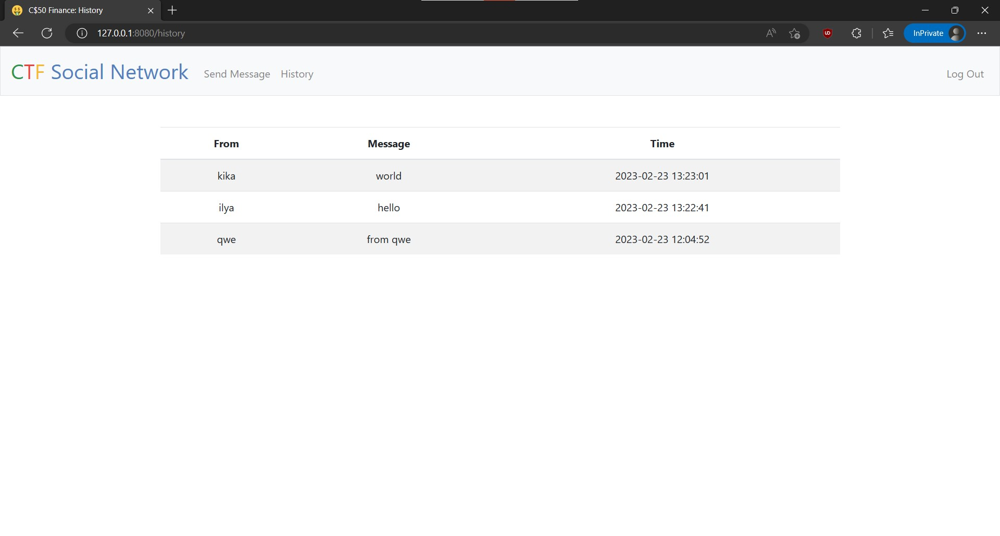
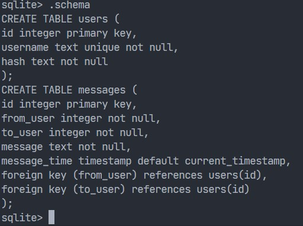

# Simple social network

Simple HTTP-server for messaging.  

Feautures:

- Has login/registration form.
- Users can communicate by sending direct messeages to each others.
- It is possible to access list of your messages.

All information is stored in SQLite database:

