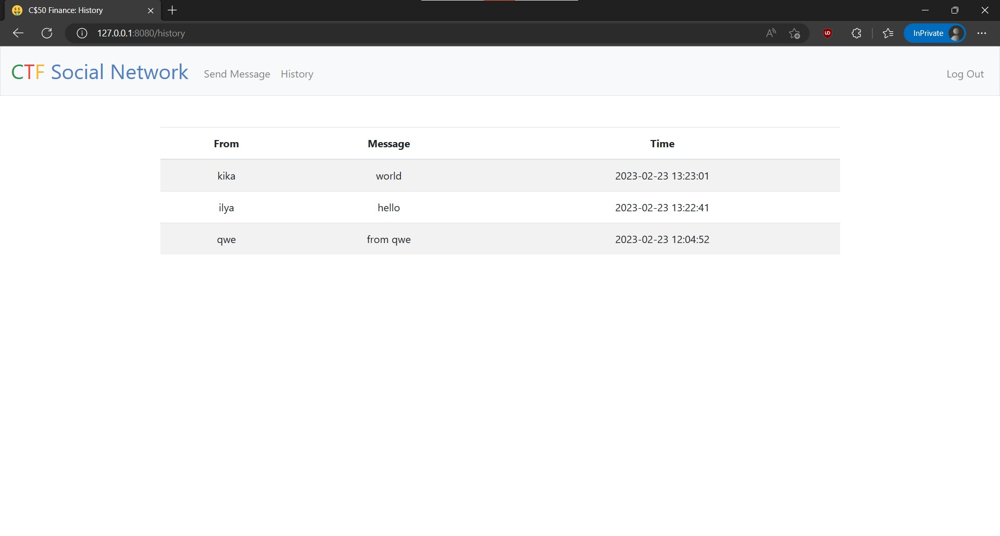

# simple-social-network

[](https://github.com/aimclub/OSA)

## Overview

This project provides a straightforward platform for users to connect and communicate. It enables individuals to register, log in, and exchange direct messages with others, offering a simple way to interact and maintain conversations within a personal network.

## Table of Contents

- [Core features](#core-features)
- [Installation](#installation)
- [Getting Started](#getting-started)
- [Contributing](#contributing)
- [Citation](#citation)

## Core features

1.  **User Authentication**: Allows users to register for new accounts and log in to existing ones, securing access to the social network's features.
2.  **Direct Messaging**: Enables authenticated users to send private messages to other registered users within the platform.
3.  **Message History**: Provides users with a view of all messages they have received, ordered by the time they were sent.
4.  **SQLite Database Storage**: All user information, including credentials and messages, are persistently stored in an SQLite database.

## Installation

Install simple-social-network using one of the following methods:

**Build from source:**

1.  Clone the simple-social-network repository:

    ```sh
    git clone https://github.com/DRMPN/simple-social-network
    ```

2.  Navigate to the project directory:

    ```sh
    cd simple-social-network
    ```

3.  Install the project dependencies:

    ```sh
    pip install -r requirements.txt
    ```

## Getting Started

To get started with the simple social network, you can see an example of its user interface below:



## Contributing

-   **[Report Issues](https://github.com/DRMPN/simple-social-network/issues)**: Submit bugs found or log feature requests for the project.

## Citation

If you use this software, please cite it as below.

### APA format:

    DRMPN (2023). simple-social-network repository [Computer software]. https://github.com/DRMPN/simple-social-network

### BibTeX format:

    @misc{simple-social-network,

        author = {DRMPN},

        title = {simple-social-network repository},

        year = {2023},

        publisher = {github.com},

        journal = {github.com repository},

        howpublished = {\url{https://github.com/DRMPN/simple-social-network.git}},

        url = {https://github.com/DRMPN/simple-social-network.git}

    }